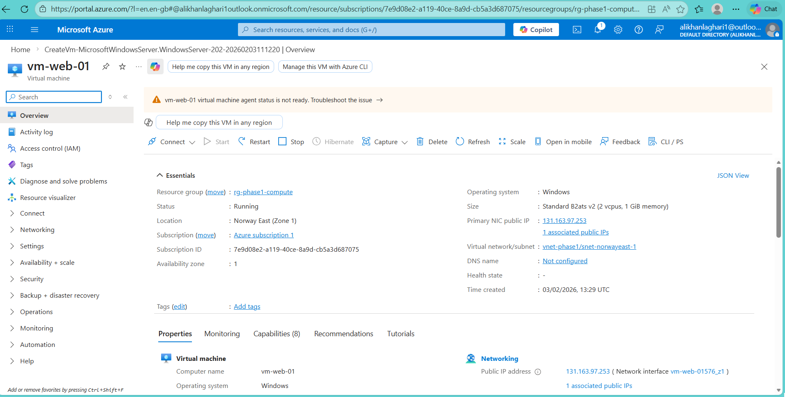
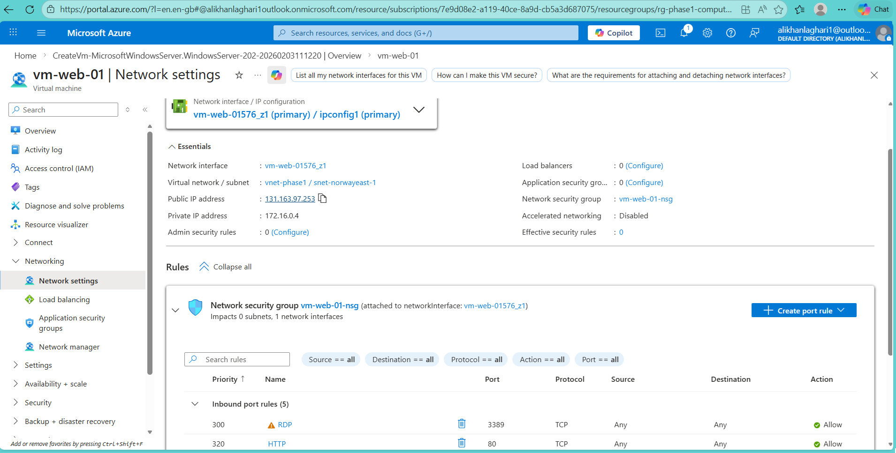
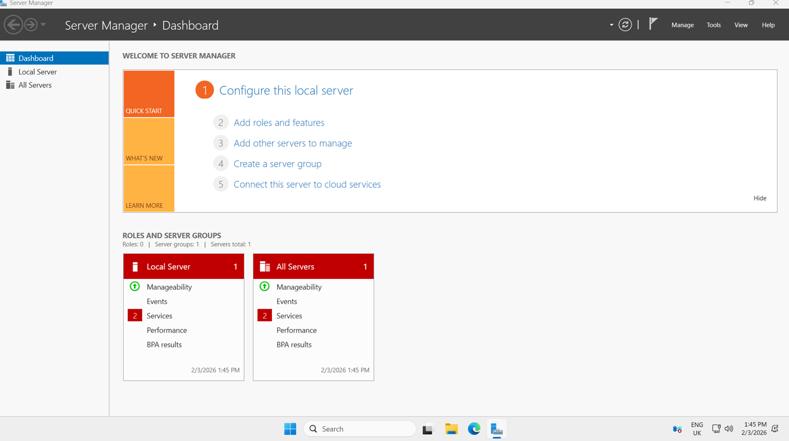
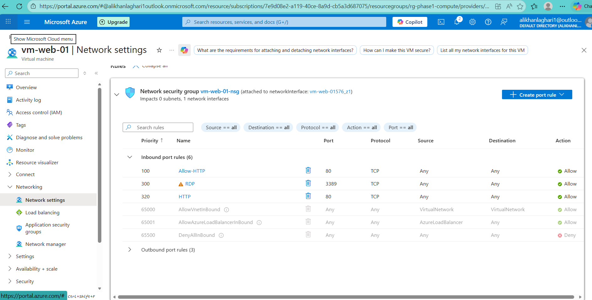
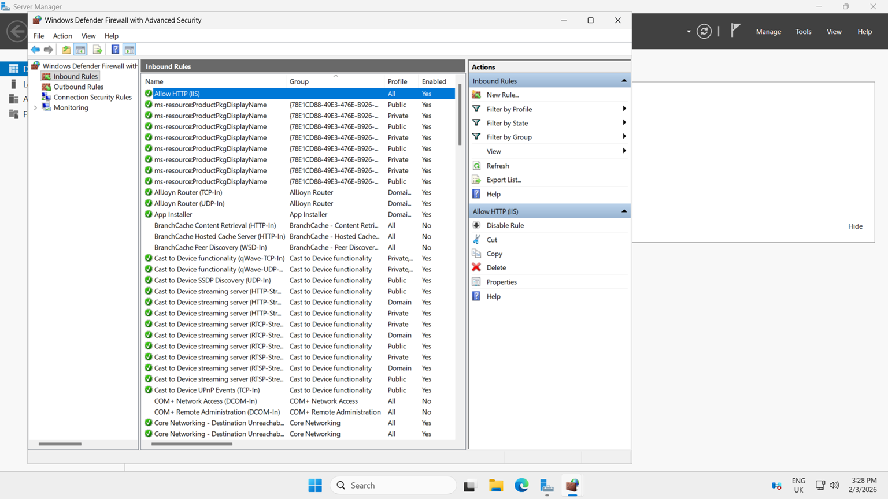
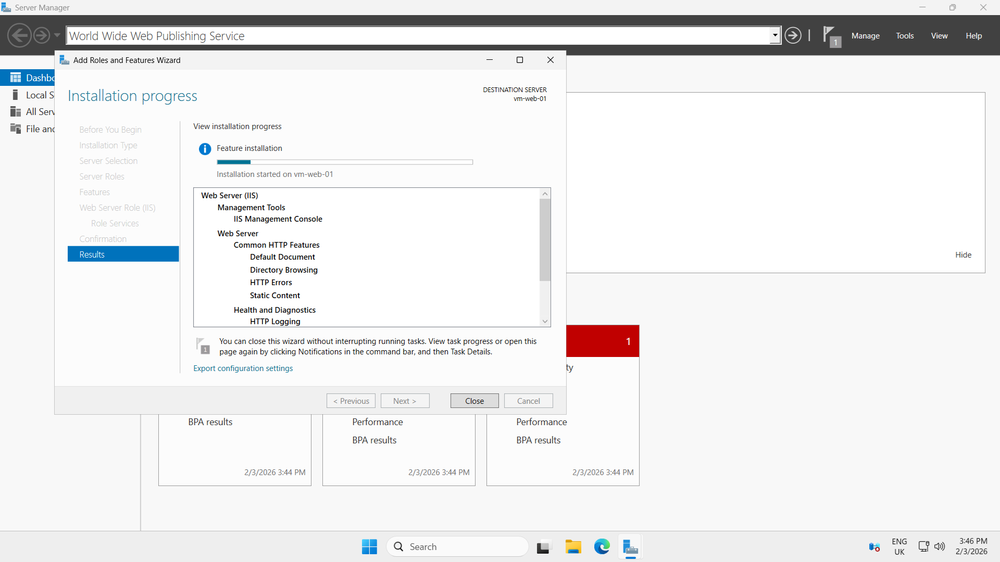
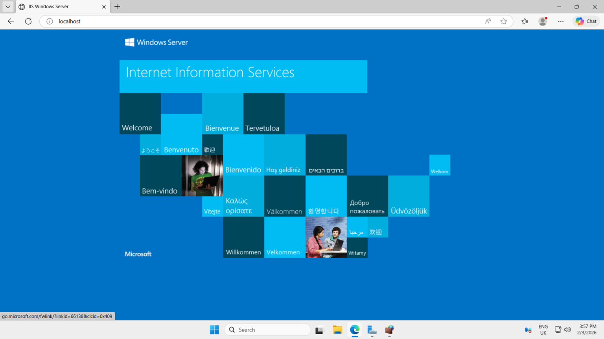
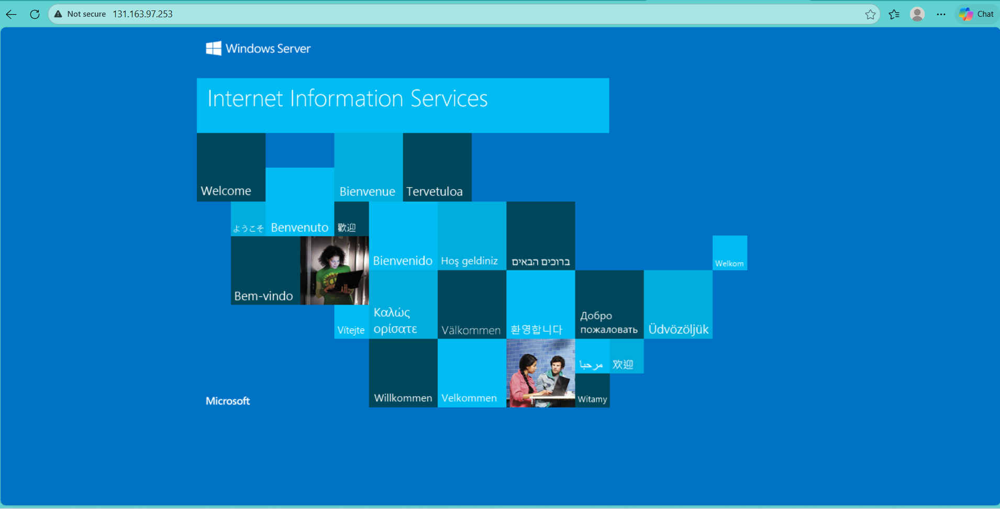

# Phase 1 – Compute (Virtual Machine)

This phase focuses on deploying a secure Azure Virtual Machine and automating application installation using VM extensions.

## Deployment Evidence

### Resource Group Creation

### Virtual Machine Overview

### VM Networking Configuration

### Remote Desktop Access

### Network Security Configuration

Inbound traffic is controlled using Azure Network Security Groups (NSGs).
HTTP (port 80) is explicitly allowed to enable access to the IIS web application.

Remote Desktop (RDP) access is temporarily enabled for administrative
purposes during the lab phase. In a production environment, this would
be restricted to specific IP addresses or replaced with Azure Bastion
to reduce the attack surface.

### IIS Installation and Validation

During validation, it was identified that IIS was not installed on the VM.
The Web Server (IIS) role was installed using Server Manager, and services
were verified to be running.

Both local and external access were tested to confirm successful deployment.
This troubleshooting highlighted the importance of validating service
installation in addition to infrastructure configuration.

## Key Learnings

- Azure infrastructure must be validated at multiple layers (network, OS, service)
- Network Security Groups and Windows Firewall both contribute to defense-in-depth
- Service availability must be verified, not assumed
- Structured troubleshooting is critical for application reliability
- Clear documentation improves operational transparency

## Outcome

Phase 1 successfully established a secure and functional compute foundation
by deploying a Windows Server VM, configuring network access, and hosting
a web application using IIS. This phase provides a stable baseline for
introducing advanced networking and security concepts in subsequent phases.
