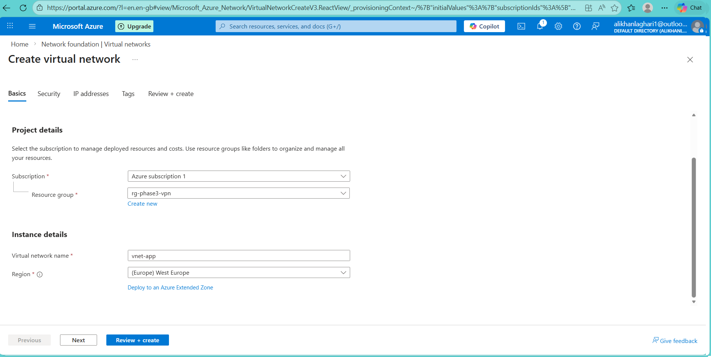
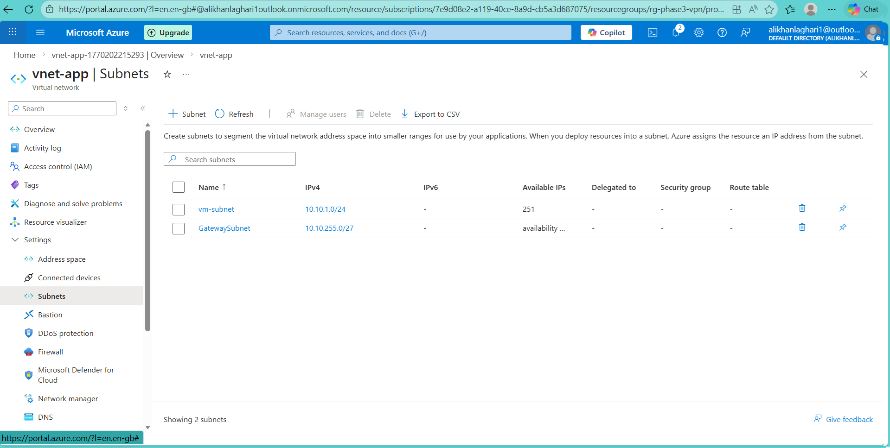
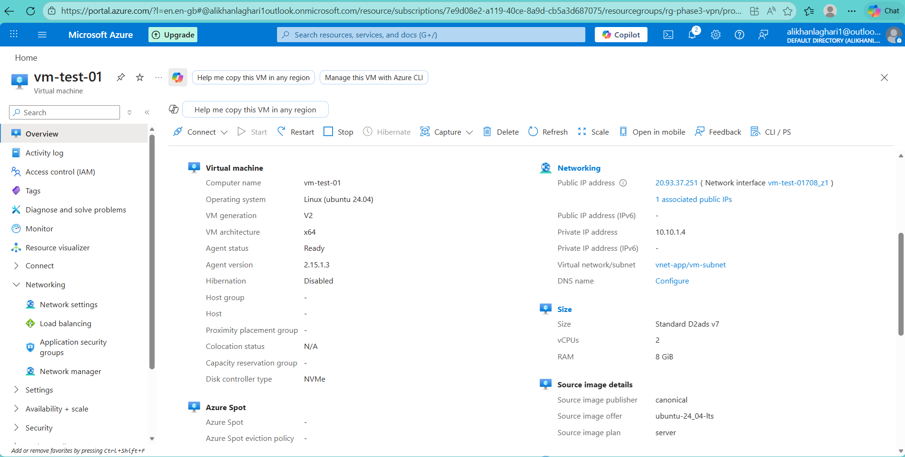
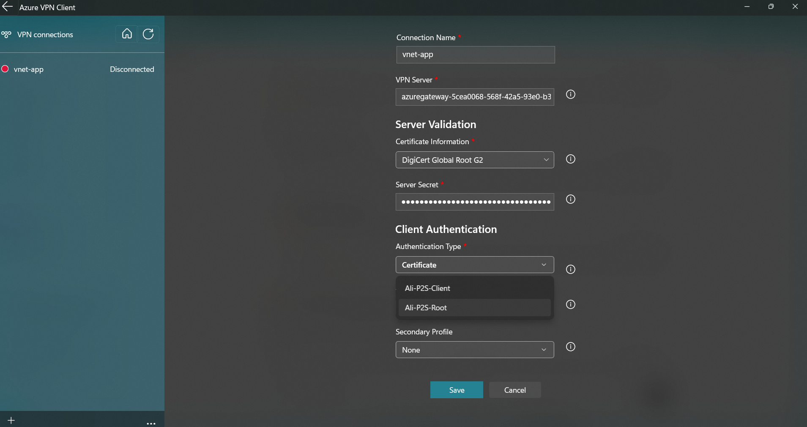

# Phase 3 – Hybrid Connectivity – Point-to-Site VPN (Certificate-based)

## Overview
This phase demonstrates secure hybrid connectivity using an Azure Point-to-Site (P2S) VPN with certificate-based authentication.

The goal is to enable a remote client to securely access Azure private resources over an encrypted tunnel without exposing virtual machines to the public internet.

This setup reflects a common enterprise remote-access pattern and aligns with AZ-104 networking objectives.

---

## Architecture
- One Azure Virtual Network (`vnet-app`)
- Application subnet hosting a Linux virtual machine
- Dedicated `GatewaySubnet`
- Azure VPN Gateway (Route-based)
- Point-to-Site VPN using:
  - Azure certificate authentication
  - OpenVPN (SSL)
- Azure VPN Client on Windows

---

## What was built
- Resource group for hybrid connectivity
- Virtual Network with application and gateway subnets
- Linux virtual machine with private IP only
- Public IP for VPN Gateway
- Route-based Azure VPN Gateway
- Root and client certificates
- Point-to-Site VPN configuration
- Azure VPN Client profile
- End-to-end connectivity validation

---

## Deployment Evidence

### Resource Group Created

### Virtual Network and Subnets

### Virtual Machine Deployment

### VPN Gateway Infrastructure

### Point-to-Site Configuration

### Client-Side Setup

### Connectivity Validation

---

## Verification & Testing
- VPN tunnel established successfully using certificate authentication
- Client assigned IP from P2S address pool
- Private IP of Azure VM reachable from local machine
- ICMP (ping) confirmed end-to-end encrypted connectivity

---

## Key Learnings
- Point-to-Site VPN enables secure remote access without public VM exposure
- Certificate-based authentication provides strong identity assurance
- VPN Gateway deployment is time-consuming and cost-sensitive
- Correct certificate hierarchy (Root → Client) is critical
- Validation must include real traffic testing, not only deployment success

---

## Enterprise Perspective
In production environments, Point-to-Site VPNs are commonly used for:
- Secure remote employee access
- Administrative access to private workloads
- Temporary contractor or vendor connectivity
- Hybrid access without site-level infrastructure

This architecture forms a foundation for future expansion into Site-to-Site VPN and hub-and-spoke network designs.

---

## Outcome
Phase 3 successfully established secure hybrid connectivity between a remote client and a private Azure virtual machine using Point-to-Site VPN.

The environment was validated, documented, and safely torn down to prevent unnecessary cloud costs.

